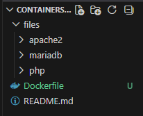
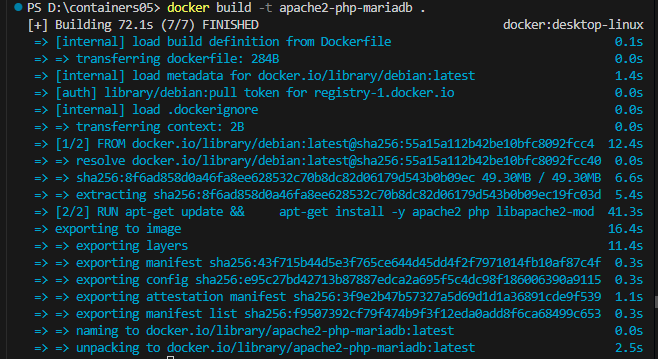
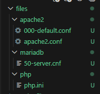
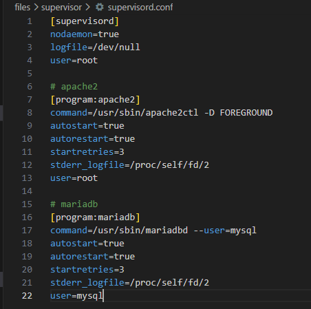
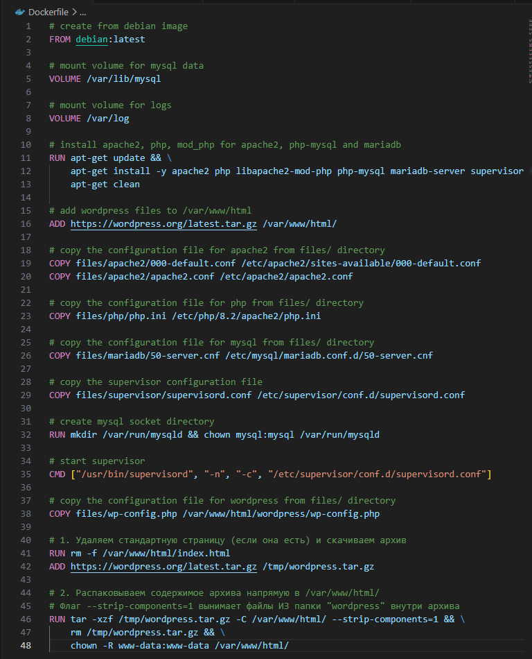
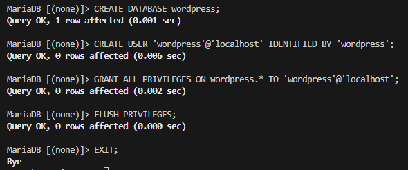
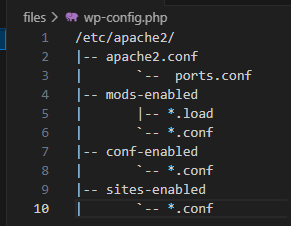
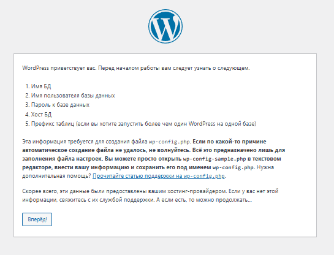
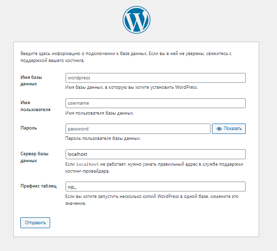

# Лабораторная работа №5: Запуск сайта в контейнере
## Цель работы

## Задание
Создать Dockerfile для сборки образа контейнера, который будет содержать веб-сайт на базе Apache HTTP Server + PHP (mod_php) + MariaDB. База данных MariaDB должна храниться в монтируемом томе. Сервер должен быть доступен по порту 8000.

Установить сайт WordPress. Проверить работоспособность сайта.

## Выполнение

 Извлечение конфигурационных файлов apache2, php, mariadb из контейнера

Создаю необходимые папочки и файл с заданным содержимым:

Строю образ контейнера:

Далее запускаю контейнер в фоновом режиме и проверяю работает ли он.

Успешно копирую файлы конфигурации:

Заменила некоторые строки в конфигурационных файлах.

Создала скрипт запуска.

Добавила новые строки в  Dockerfile.

Создание базы данных и пользователя:

Создание файла конфигурации WordPress:

Далее я добавила этот конфиг в Dockerfile.

Пересоберала образ контейнера с именем apache2-php-mariadb и запустила контейнер apache2-php-mariadb из образа apache2-php-mariadb.

Судя по всему, все работает!!

Ответы на вопросы:

1. Какие файлы конфигурации были изменены?

Apache: 000-default.conf (настройка сайта) и apache2.conf (глобальные параметры).

PHP: php.ini (лимиты памяти и загрузки).

MariaDB: 50-server.cnf (логирование ошибок).

WordPress: wp-config.php (связь с базой данных).

2. За что отвечает инструкция DirectoryIndex?
   
Она устанавливает приоритет поиска индексного файла. Если в папке есть и index.php, и index.html, сервер первым откроет тот, что указан в списке раньше.

3. Зачем нужен файл wp-config.php?
   
Это главный файл настроек WordPress. В нем хранятся реквизиты доступа к базе данных (имя, пользователь, пароль), ключи безопасности и префиксы таблиц. Без него сайт не сможет подключиться к данным.

4. За что отвечает параметр post_max_size?

Он ограничивает максимальный объем данных, который сервер может принять за один раз через метод POST. Этот лимит должен быть больше или равен upload_max_filesize, чтобы загрузка файлов не прерывалась.

5. Недостатки созданного образа:

- Нарушение принципа «один процесс — один контейнер»: в идеале Apache и MariaDB должны быть в разных контейнерах.

- Большой размер: образ на базе Debian тяжелее, чем специализированные образы (например, Alpine).

- Безопасность: пароли прописаны в открытом виде внутри конфигурационных файлов образа.

- Сложность обновления: нельзя обновить версию PHP, не затронув базу данных и сервер.